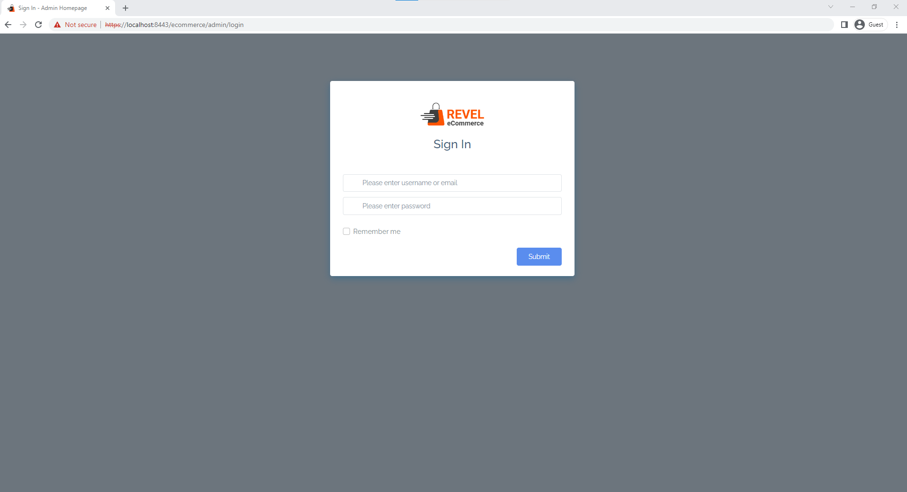
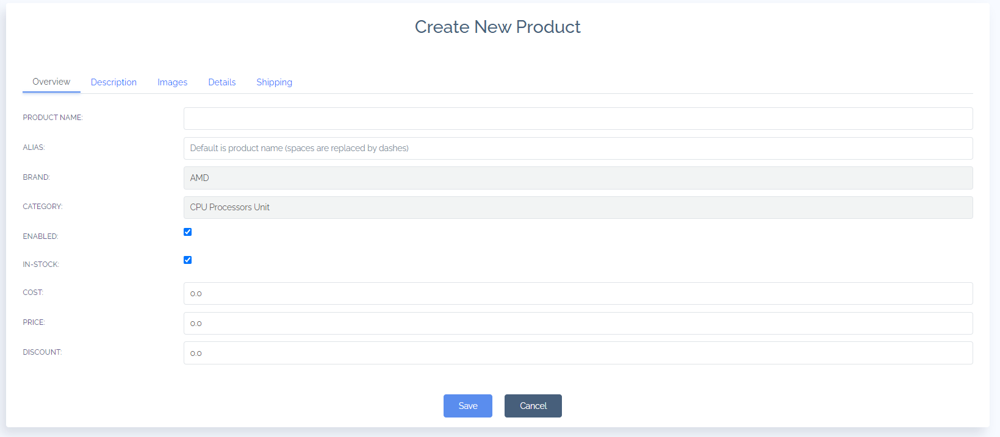
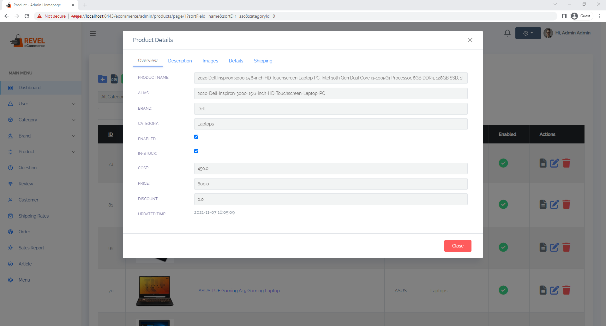
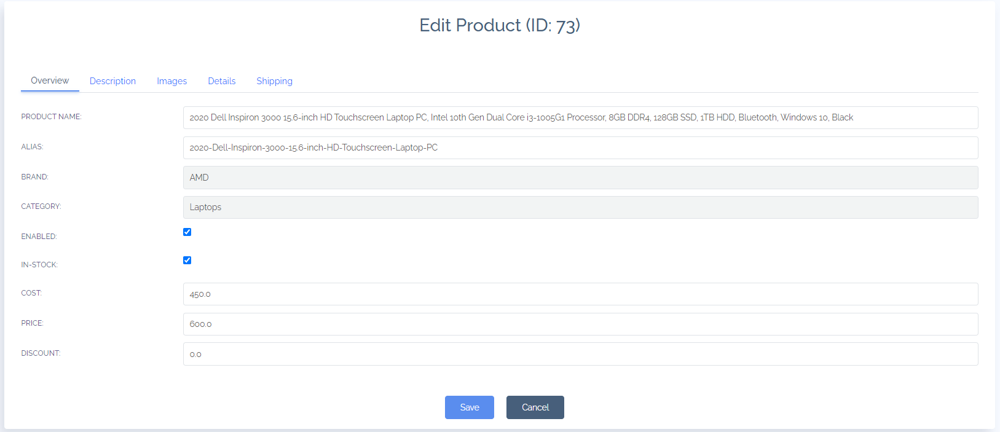
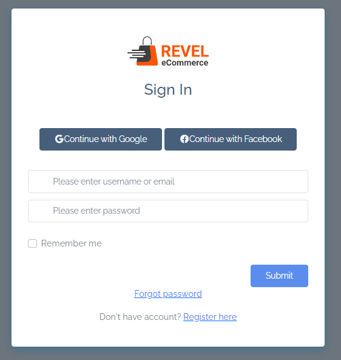
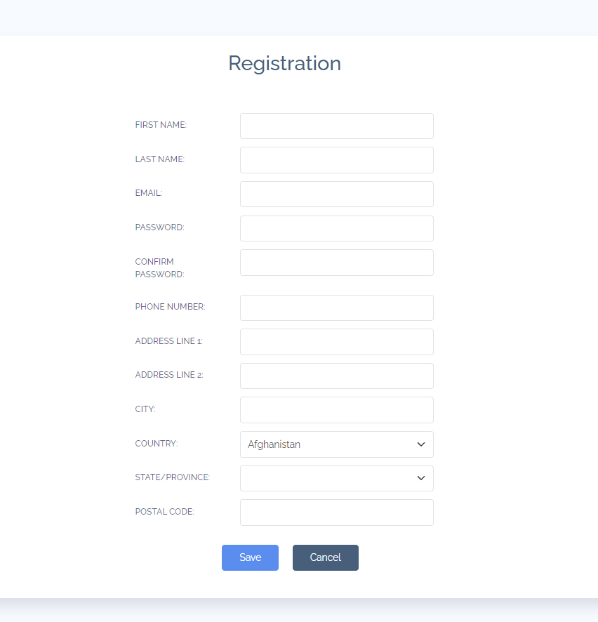

# doc-for-ecommerce-project

# Results

## Admin Application:
### 1.Login
Login page. User will be locked 24h if they fail to log in 5 times

### 2.User Management (for 'ADMIN' only)
- In this page you can:
  - Sorting users by id, name, email, full name, enabled status.
  - Search user by entering keyword in search field and click search button.
  - Disable a user 
  - Export all users to a .pdf file by click . Similar for export file .csv and .xlxs.
  - Delete a user
  - Edit a user

- List all users:

- Create new user. 

- Edit information of existing user

### 3. Category Management 
- In this page, you can:
  - Disable a category
  - Edit a category
  - Delete a category (note: only category with no subcategory can be deleted)

- List all category:

### 4. Brand Management
- In this page you can:
    - Add new brand.
    - Sorting brands by name.
    - Search brand by entering keyword in search field and click search button.
    - Disable a brand.
    - Export all brand to a pdf file. Similar for export file csv and xlxs file.
    - Delete a brand.
    - Edit a user.

- View all brands:

- Create a new brand:

- Edit existing brand:

### 5. Product Management
- In this page you can:
    - Add new product.
    - Sorting products by id, name, brand, category.
    - Search product by entering keyword in search field and click search button.
    - Disable a product.
    - Export all product to a pdf file. Similar for export file csv and xlxs file.
    - Delete a product.
    - Edit a product.

- View all product

- Create new product (you need to enter all required fields in all tab to submit a new product).

- Quicky view product details.

- Edit product

### 6. Setting Management
- In this page you can:
    - Change site information, currency in the 'General' tab.
    - Add/remove/change country and state information in the 'Countries' and 'States' tab.
    - Change mail server setting in the 'Mail Server' tab.
    - Change mail templates to verify new customer registration in the 'Mail templates' tab.
    - Change payment in the 'Payment' tab.

- General Setting

- Countries 

- States Setting

- Mail Server

### 7. Customer Management
- In this page you can:
    - Sorting customers by id, full name, city, state, country, enabled status.
    - Search customer by entering keyword in search field and click search button.
    - Disable a customer.
    - Export all customers to a pdf file. Similar for export file csv and xlxs file.
    - Delete a customer.
    - Edit a customer.

## Shopping App
### 1. Customer
- Customer can sign in with:
  - Email and password.
  - Google
  - Facebook
- Customer login page.

- Sign up:
  After customer submit registration form, they need check their email and click verify link to active their account.

Sign up page

- Forgot password:
  To reset account password, customer need to enter their email to receive a link to reset their password.
