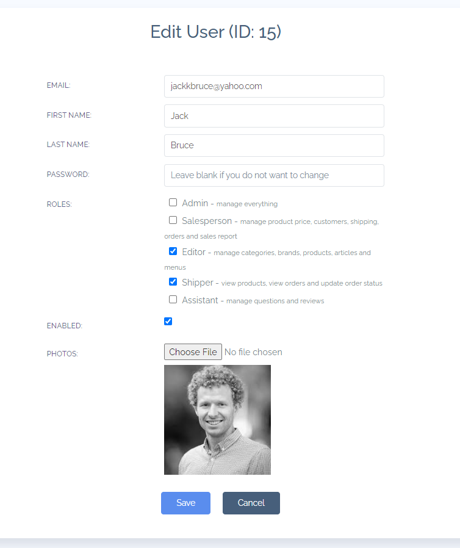
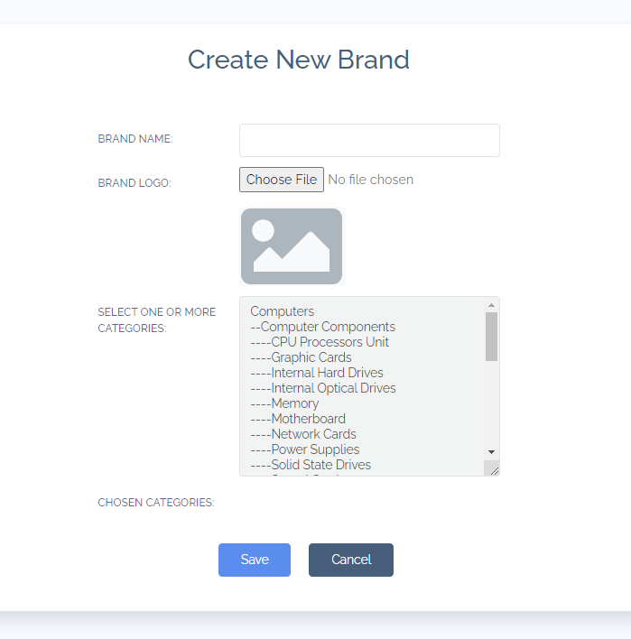
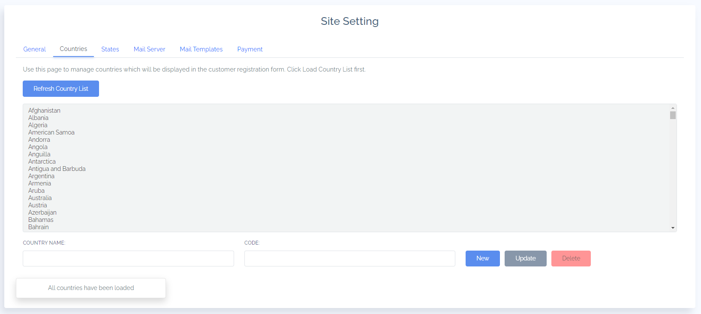

# doc-for-ecommerce-project

# Results

## Admin Application:
### 1.Login
Login page. User will be locked 24h if they fail to log in 5 times

### 2.User Management (for 'ADMIN' only)
- List all users:
  - Sorting users by id, name, email, full name, enabled status.
  - To disable a user: click :tw-2705:
  - To export all users to a pdf file. Click: . Similar for export file .csv and .xlxs.
  - To delete a user: click
  - To eidit a user: click

- Create new user. 

- Edit information of existing user

### 3. Category Management 

### 4. Brand Management

### 5. Product Management

### 6. Setting Management

### 7. Customer Management

